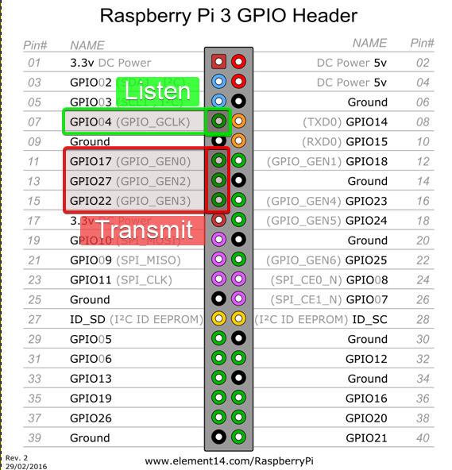

# pi-gpio-synced-player

## Overview

A quick script to facilitate syncronized playback of video across multiple
Raspberry Pi units

### Why

This is a modification of a script written for a specific art installation. It
likely won't be broadly useful!

## Details

This script uses the `mpv` player, and the `pympv` Python module (for playback
control), with simple GPIO communications to ensure players start in sync.

## Wiring



## Usage

### Setup

#### Install mpv and pympv on each Pi

```bash
sudo apt update
sudo apt install mpv libmpv1 libmpv-dev python3-pip
sudo pip3 install pympv
```

#### Edit the file

Set the options in the file as needed - particularly `mode = 'primary'` or `mode = 'secondary'`
and `media_file = 'your_media_file.mp4'`

# Filename to play
mfile = 'your_media_file.mp4'
Edit the file, etc,  etc.
(TODO)

